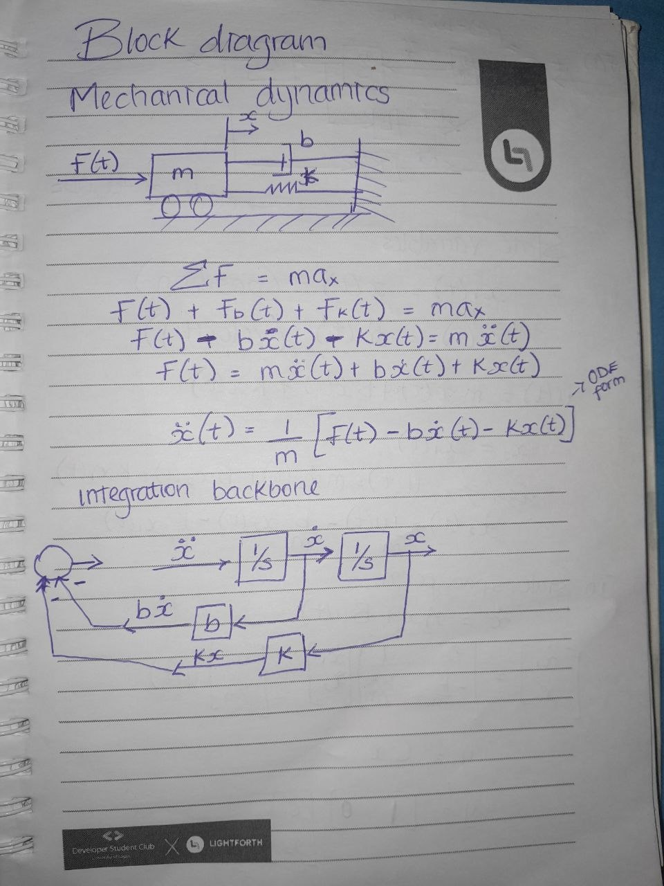
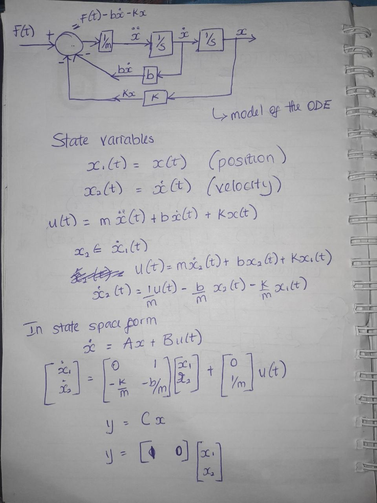
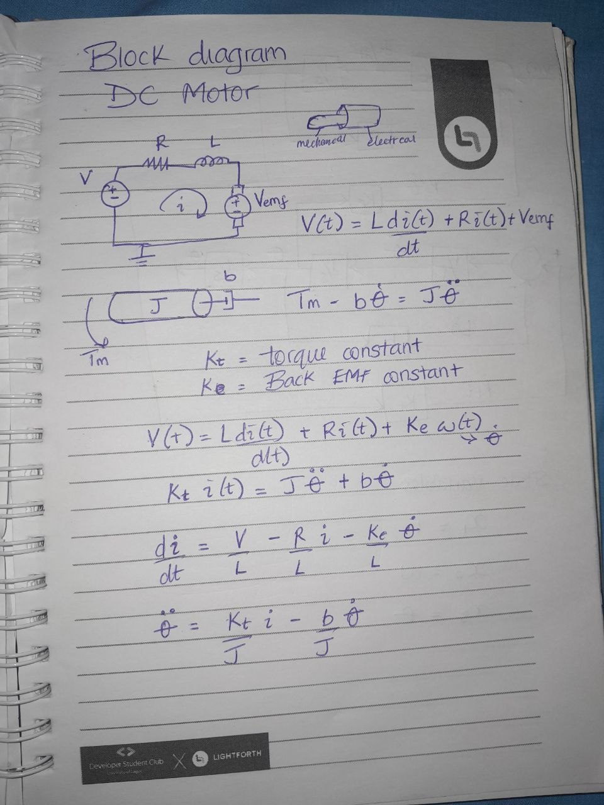
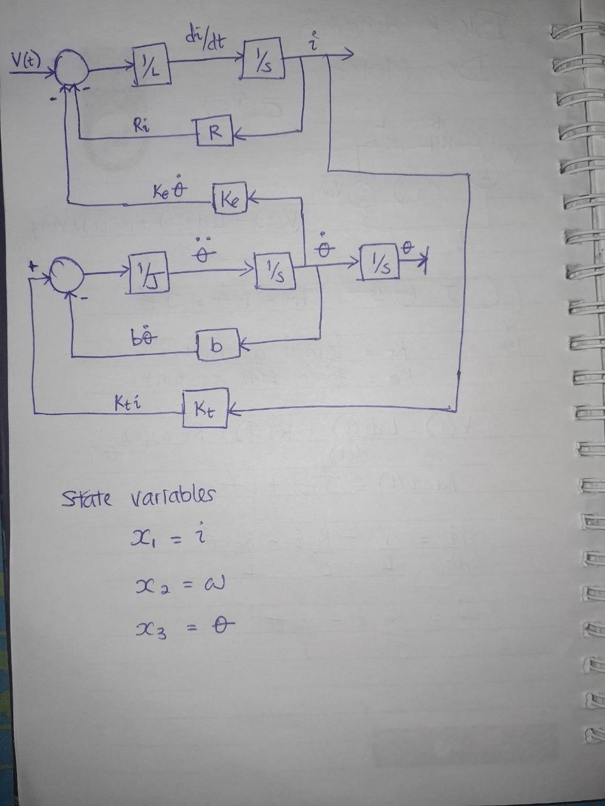
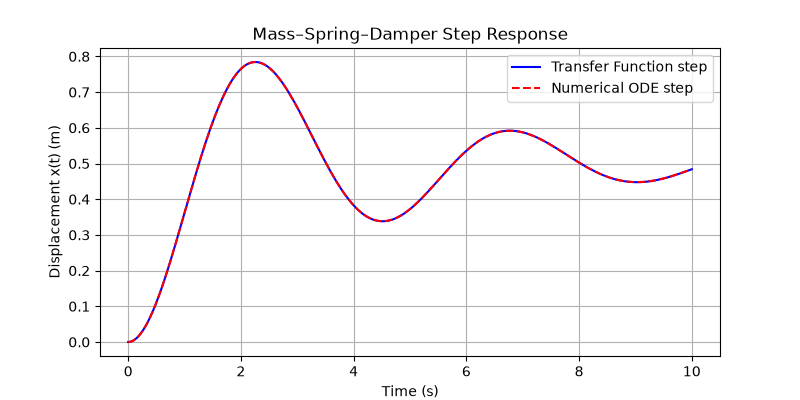

# Exercise - Week 1: Modelling dynamic systems

## Task
Write a Python function that builds the DC motor speed transfer function from (J, b, K, R, L) with python-control, and compare its step response to a numerical ODE simulation with scipy.integrate.solve_ivp.

## Approach
<!-- What you did and why -->
### Monday 
I reviewed the kinetic and potential energy of a mass-spring-damper system, as well a the electromechanical equations for a DC motor. Skecthed the clock diagrams for a mass-spring-damper system and a DC motor (electrial + mechanical), stating the state variables. 

### Tuesday
I derived the ODE equations for the systems from first principles. Wrote a python script taht defines the RHS of the ODEs as a function for solve_ivp for both systems. Ploted the analytical step response of teh transfer fuction, as well as the numerical ODE step for the mass spring damper system.

### Wednesday 
Derived the Laplace Transform equations for teh two systems from their ODs to find teh Transfer Function. 

## Results
<!-- Plots (save PNGs in this folder and embed them: ) and key numbers -->

### Mass-spring-damper system

### DC Motor 

### Mass-spring-damper Step Respone

### DC Motor Step Response

## Takeaways
-
